# LR6
Лабораторная работа №6

# Система контроля версий

## Цель работы
Изучение базовых возможностей системы управления версиями, опыт работы с Git Api, опыт работы с локальным и удаленным репозиторием.

## 1. Клон репозитория и добавление файла через интерфейс GitHub

Изначально был выполнен клон репозитория в локальное хранилище с помощью команды git clone. 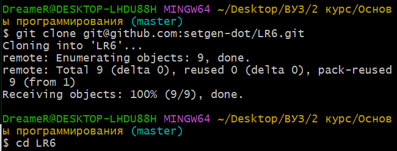

В интерфейсе GitHub с помощью add был добавлен файл fileFromGitHubInterface, и сделан pull для получения данного файла в личный репозиторий. 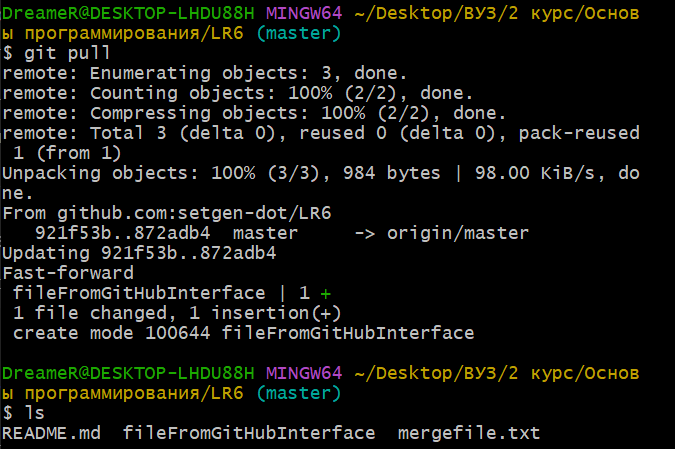

## 2. Настройка клиента Git

Далее были добавлены имя пользователя и email. Эти данные будут использоваться при создании коммитов. 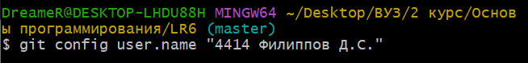 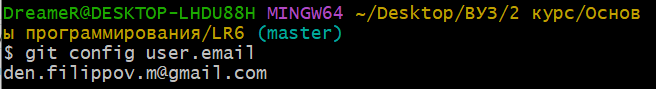

## 3 Получение истории операций для каждой из веток и последующее их слияние.

Для начала необходимо создать новую ветку с помощью команды git branch "название ветки", далее переходим в эту ветку командой checkout, изменяем файл mergefile.txt и коммитим изменения. Далее меняем тот же файл в ветке master и разрешаем merge conflict в файле и после этого удаляем новую ветку feature. 
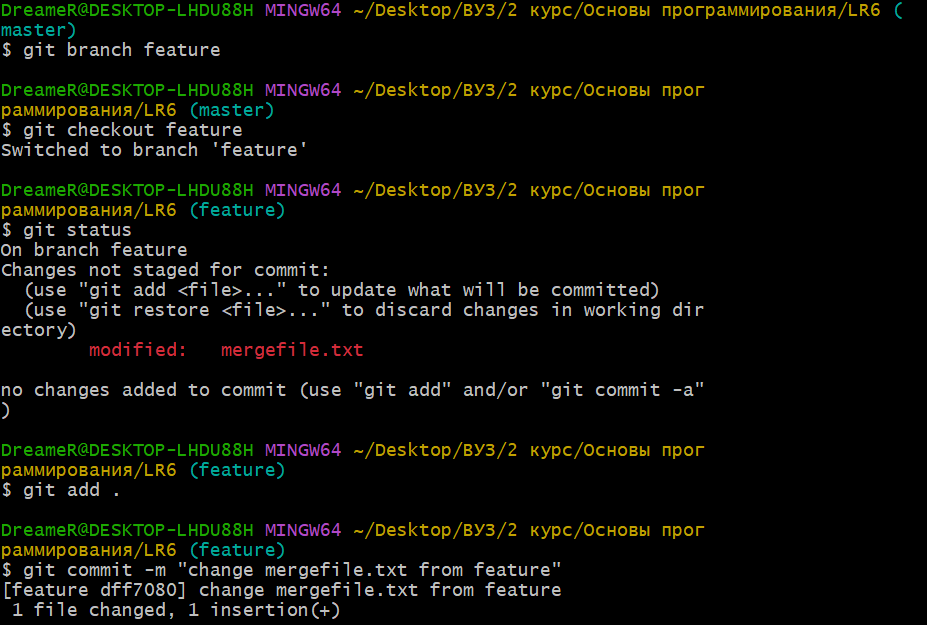
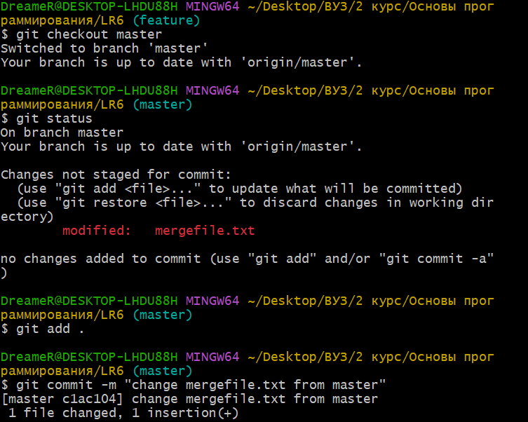
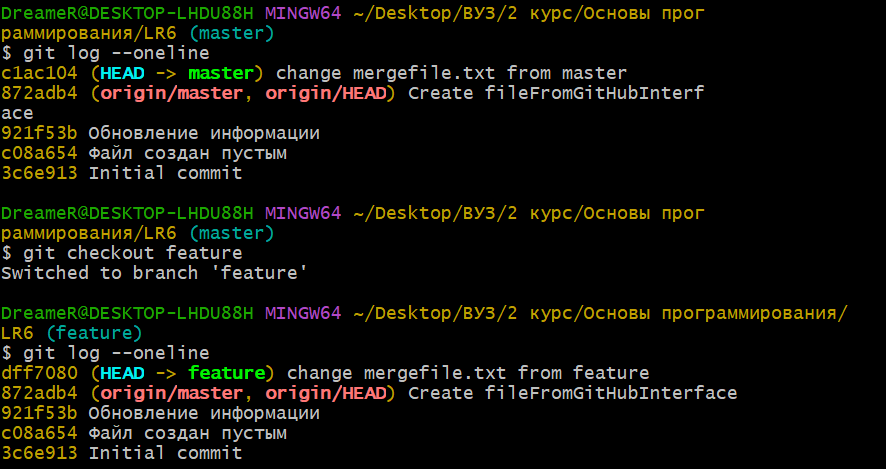
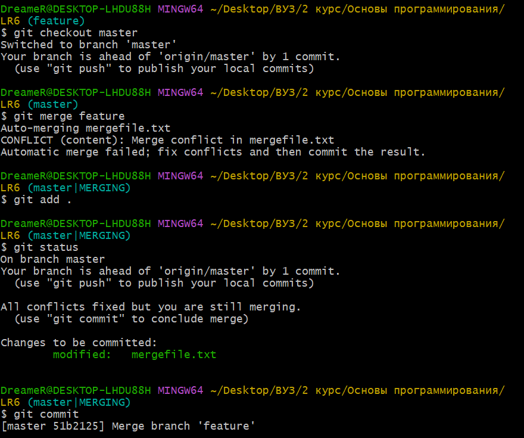
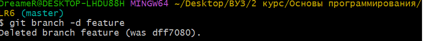

## 5 Добавление изменений и откат коммита

Во-первых создаем файл changes.txt и коммитим его, после добавляем еще один файл newChanges.txt и так же его коммитим. После второго коммита делаем откат с помощью команжды git reset
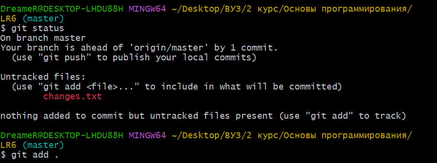
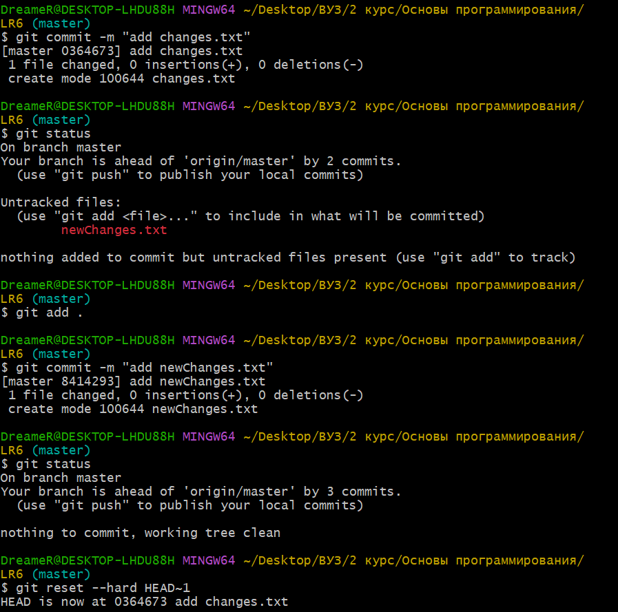

